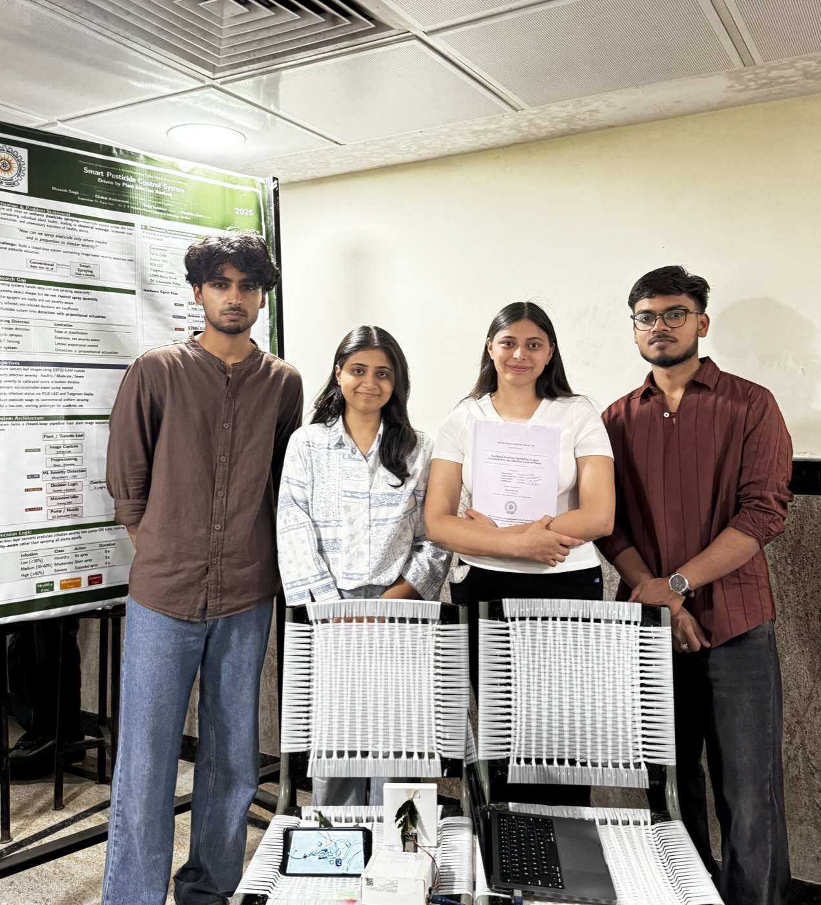

<div align="center">


# Intelligent Pesticide Sprinkling System

**Determined by the Infection Level of Plants**

An IoT and AI system that detects tomato-leaf infection severity and sprays pesticide proportionally, reducing waste while logging every event to a live dashboard.


</div>

---

## Team

> **Dr. B. R. Ambedkar NIT Jalandhar** • Department of Instrumentation & Control Engineering • B.Tech 2023–27

| Member            | Roll No. |
| ----------------- | -------- |
| Bhavesh Singh     | 23106030 |
| Chahat Kesharwani | 23106032 |
| Sadgi Saraswat    | 23106078 |
| Vanshika Soni     | 23106099 |

**Supervisor:** Dr. Karan Veer, Assistant Professor

<div align="center">



<sub>The team presenting the project and poster at the Minor Project Phase-II evaluation, NIT Jalandhar.</sub>

</div>

## About the Project

- **Capture** — ESP32-CAM grabs a live leaf image.
- **Classify** — Google Gemini grades infection severity: Healthy, Moderate, or Severe.
- **Spray** — Arduino UNO runs the pump for a severity-based duration.
- **Monitor** — React dashboard logs scans, trends, and pesticide savings in real time.

Goal: at least 40% less pesticide than uniform spraying, with hardware under Rs. 5,000.

## Tech Stack

- **Backend:** FastAPI, WebSockets, SQLite, Google Gemini, PySerial
- **Frontend:** React 19, Vite, TailwindCSS, Recharts
- **Hardware:** ESP32-CAM, Arduino UNO, 12V pump and solenoid valve

## Setup

**Backend**

```bash
pip install -r backend/requirements.txt
python run.py        # http://localhost:8000
```

**Frontend**

```bash
cd frontend
npm install
npm run dev          # http://localhost:5173
```

## Usage

1. Start the backend, then the frontend.
2. Open http://localhost:5173.
3. Click **Scan Now** to capture and analyze a leaf, or enable **Auto-Scan** for continuous monitoring.
